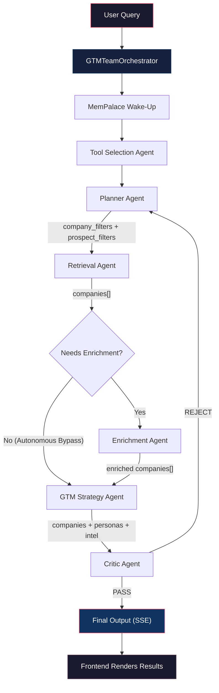

<p align="center">
  <h1 align="center">🎯 GTM Intelligence</h1>
  <p align="center">
    <strong>Multi-Agent B2B Sales Intelligence Platform</strong>
  </p>
  <p align="center">
    Autonomous agents that discover, enrich, and build outreach strategies for your ideal customers — powered by Gemini and real-time market data.
  </p>
</p>

<p align="center">
  
  
  
  
  
</p>

---

## Table of Contents

- [Overview](#overview)
- [Architecture](#architecture)
- [The Agent Team](#the-agent-team)
- [Pipeline Flow](#pipeline-flow)
- [Data Sources & Tools](#data-sources--tools)
- [Resilience & Error Handling](#resilience--error-handling)
- [Project Structure](#project-structure)
- [Getting Started](#getting-started)
- [API Reference](#api-reference)
- [Environment Variables](#environment-variables)

---

## Overview

GTM Intelligence is a full-stack platform that replaces manual prospect research with an **autonomous multi-agent pipeline**. A single natural language query like:

> *"Find Series B cybersecurity startups in the US that are hiring for Sales"*

triggers a six-agent pipeline that:

1. **Discovers** matching companies via structured API filters
2. **Enriches** them with hiring signals, funding events, tech stack, and leadership changes
3. **Scores** buying intent and ICP fit using LLM reasoning
4. **Generates** persona-specific outreach hooks, email snippets, and competitive displacement angles
5. **Validates** every claim against raw signal data to prevent hallucinations

Results stream to the frontend in real-time via Server-Sent Events (SSE), with a live agent timeline showing each step's progress, confidence, and duration.

---

## Architecture

```
┌─────────────────────────────────────────────────────────────────┐
│                        FRONTEND (Next.js 16)                    │
│  ┌──────────┐  ┌───────────────┐  ┌────────────┐  ┌─────────┐  │
│  │  Prompt   │  │ Agent Timeline│  │ Result     │  │ Persona │  │
│  │  Input    │  │ (Live SSE)    │  │ Cards      │  │ Tabs    │  │
│  └──────────┘  └───────────────┘  └────────────┘  └─────────┘  │
│                         ↕ SSE Stream                            │
├─────────────────────────────────────────────────────────────────┤
│                        BACKEND (FastAPI)                        │
│                                                                 │
│  ┌─────────────────────────────────────────────────────────┐    │
│  │              GTMTeamOrchestrator                         │    │
│  │                                                         │    │
│  │  ┌─────────┐ ┌─────────┐ ┌───────────┐ ┌────────────┐  │    │
│  │  │  Tool   │→│ Planner │→│ Retrieval │→│ Enrichment │  │    │
│  │  │Selection│ │         │ │           │ │            │  │    │
│  │  └─────────┘ └─────────┘ └───────────┘ └────────────┘  │    │
│  │                                              ↓          │    │
│  │                              ┌────────────┐ ┌────────┐  │    │
│  │                              │   GTM      │→│ Critic │  │    │
│  │                              │  Strategy  │ │        │  │    │
│  │                              └────────────┘ └────────┘  │    │
│  └─────────────────────────────────────────────────────────┘    │
│                                                                 │
│  ┌──────────────┐  ┌──────────────┐  ┌───────────────────────┐  │
│  │  Explorium   │  │  TheirStack  │  │  MemPalace + SQLite   │  │
│  │  (Companies, │  │  (Tech Stack)│  │  (Memory, Cache,      │  │
│  │   Prospects,  │  │              │  │   Session History)    │  │
│  │   Events)    │  │              │  │                       │  │
│  └──────────────┘  └──────────────┘  └───────────────────────┘  │
└─────────────────────────────────────────────────────────────────┘
```

| Layer | Technology | Purpose |
| :--- | :--- | :--- |
| **Frontend** | Next.js 16, React 19, Tailwind CSS, Radix UI, Lucide Icons | Real-time "Command Center" UI with SSE-driven agent timeline |
| **API** | FastAPI, SSE-Starlette, SlowAPI | REST + SSE streaming endpoints with rate limiting and API key auth |
| **Agent Framework** | Agno | Agent orchestration, tool binding, memory, and structured output |
| **Intelligence** | Google Gemini (3.1 Flash Lite → 3 Flash → 3.1 Pro) | LLM reasoning for planning, scoring, strategy, and validation |
| **Data APIs** | Explorium, TheirStack | Company search, enrichment, events, prospects, tech stack |
| **Memory** | MemPalace, SQLite | Persistent agent memory ("diaries"), API response caching, run history |

---

## The Agent Team

The pipeline uses six specialized agents, each with a single responsibility:

### 1. 🔧 Tool Selection Agent
**File:** `agents/tool_selection.py`

Analyzes the user query and selects which data tools (hiring signals, funding, tech stack, etc.) are most relevant. Outputs a prioritized signal list so downstream agents focus on the right data.

### 2. 📋 Planner Agent
**File:** `agents/planner.py`

The brain of the pipeline. Breaks down the query into a structured execution plan and translates user intent into **precise Explorium API filters**:

- Maps natural language ("cybersecurity") to validated LinkedIn categories (`computer and network security`)
- Maps funding stages ("Series B") to company size, revenue, and age filter combinations
- Validates all enum values against a known-good reference (company_size, revenue ranges, job levels, departments)
- Extracts both company and prospect filter objects

### 3. 🔍 Retrieval Agent
**File:** `agents/retrieval.py`

Executes **deterministic** (no LLM) data retrieval using the Planner's filters:

- Searches Explorium for matching companies
- Resolves each company to an `explorium_id` via the Match Business API
- Fetches prospect contacts filtered by job level and department
- All operations run in parallel via `asyncio.gather`

### 4. 📊 Enrichment Agent
**File:** `agents/enrichment.py`

Enriches each company with deep signal data, then uses a **single LLM call** to score all companies at once:

- **Deterministic fetches** (parallel): Business events, tech stack (TheirStack), deep enrichment (Explorium)
- **Signal extraction**: Hiring signals, funding rounds, leadership changes, strategic events (M&A, partnerships, product launches, cost cutting)
- **LLM scoring**: `buying_signal_score` and `icp_score` (0.0–1.0) with structured `buying_signals` array

### 5. 🎯 GTM Strategy Agent
**File:** `agents/gtm_strategy.py`

Generates the outreach playbook for every company:

- **Persona-specific hooks** for CEO, VP Sales, CTO with pain points, message angles, and ready-to-copy email snippets
- **Competitive intelligence**: competitor identification, displacement angles, and landmine questions
- **Recommended engagement sequence**: step-by-step outreach plan
- Includes a safety merge that preserves all original company data even if the LLM drops entries

### 6. ✅ Critic Agent
**File:** `agents/critic.py`

The hallucination guardrail. Validates **every generated hook** against the raw signal data:

| Checks For | Example |
| :--- | :--- |
| Tech stack hallucinations | Hook says "AWS" but tech stack shows "GCP" |
| Signal contradictions | Hook mentions "rapid expansion" but events show `cost_cutting` |
| Overconfidence on empty data | Hook references "recent Series B" when funding is `null` |

Issues a `PASS` or `REJECT` verdict. On `REJECT`, the orchestrator loops the pipeline back through Planner → Retrieval → Strategy for a retry (max 1 retry).

---

## Pipeline Flow



**Key SSE Events** streamed to the frontend:

| Event | Payload | Purpose |
| :--- | :--- | :--- |
| `pipeline_start` | `run_id`, `query`, `total_agents` | Initialize the UI timeline |
| `agent_start` | `agent`, `attempt`, `timestamp` | Show agent spinner |
| `agent_done` | `agent`, `confidence`, `duration_ms` | Show completion with metrics |
| `partial_result` | `companies[]` | Early preview after enrichment |
| `agent_retry` | `agent`, `attempt`, `reason` | Critic rejected — retrying |
| `final_output` | Full results, signals, strategy | Render the complete dashboard |
| `pipeline_complete` | `run_id`, `duration_ms`, `companies_found` | Summary statistics |
| `error` | `message` | Display error state |

---

## Data Sources & Tools

### Explorium API (`tools/company_api.py`)

| Endpoint | Function | Purpose |
| :--- | :--- | :--- |
| `POST /businesses/match` | `match_business()` | Resolve company name → `business_id` |
| `POST /businesses` | `search_companies()` | Filter-based company discovery |
| `POST /businesses` (by ID) | `enrich_company()` | Deep enrichment (revenue, employees, NAICS, etc.) |
| `POST /businesses/events` | `get_business_events()` | Hiring, funding, leadership, strategic events |
| `POST /prospects` | `fetch_prospects()` | Find contacts by job level and department |
| `POST /prospects/.../enrich` | `enrich_contact()` | Get email and phone for a prospect |

All Explorium calls are wrapped with:
- **Retry logic**: Exponential backoff on 429/503 errors
- **Persistent caching**: SQLite-backed response cache with configurable TTL (30 days default)
- **Empty result protection**: Empty responses are never cached to avoid stale data

### TheirStack API (`tools/theirstack_api.py`)

| Function | Purpose |
| :--- | :--- |
| `get_tech_stack()` | Technology stack detection for a company |

### Mock Mode

Set `USE_MOCK_DATA=True` in `.env` to use built-in mock data (5 companies with full signal coverage) without consuming any API credits. Ideal for development and UI testing.

---

## Resilience & Error Handling

### Model Rotation Protocol

The platform implements a **9-attempt rotation strategy** across 3 Gemini models and 3 API keys:

```
Attempt 1: gemini-3.1-flash-lite-preview + Key 1
Attempt 2: gemini-3.1-flash-lite-preview + Key 2
Attempt 3: gemini-3.1-flash-lite-preview + Key 3
Attempt 4: gemini-3-flash-preview         + Key 1
Attempt 5: gemini-3-flash-preview         + Key 2
Attempt 6: gemini-3-flash-preview         + Key 3
Attempt 7: gemini-3.1-pro-preview         + Key 1
Attempt 8: gemini-3.1-pro-preview         + Key 2
Attempt 9: gemini-3.1-pro-preview         + Key 3
```

- **Immediate model switch** on 503/429/overload errors
- **API key rotation** within each model tier
- **Swallowed error detection**: Catches Agno framework silently returning error JSON as valid output
- **Graceful degradation**: If all 9 attempts fail, returns a structured error message with Restart/Resume options for the frontend

### Autonomous Enrichment Bypass

The orchestrator checks if Retrieval already returned companies with complete `buying_signals` and `tech_stack`. If so, it **skips the Enrichment agent entirely** — saving LLM tokens, API calls, and latency.

### Critic Retry Loop

If the Critic detects hallucinations, it triggers a full pipeline retry (max 1). If the retry also fails, results are tagged with a `data_quality_warning` field and delivered anyway — never leaving the user with no output.

---

## Project Structure

```
gtm-intelligence/
├── docker-compose.yml              # Full-stack orchestration
├── .env                            # Environment variables (not committed)
│
├── backend/
│   ├── main.py                     # FastAPI app entry point
│   ├── config.py                   # Settings + VALID_LINKEDIN_CATEGORIES
│   ├── requirements.txt            # Python dependencies
│   ├── Dockerfile                  # Python 3.12-slim container
│   │
│   ├── agents/                     # The 6-agent team
│   │   ├── base.py                 # BaseGTMAgent, AgentRegistry, arun_with_backoff
│   │   ├── tool_selection.py       # Tool Selection Agent
│   │   ├── planner.py              # Planner Agent (filter generation)
│   │   ├── retrieval.py            # Retrieval Agent (deterministic)
│   │   ├── enrichment.py           # Enrichment Agent (signals + scoring)
│   │   ├── gtm_strategy.py         # GTM Strategy Agent (outreach)
│   │   └── critic.py               # Critic Agent (hallucination guard)
│   │
│   ├── api/
│   │   ├── routes.py               # /run, /health, /history, /agents, /logs
│   │   └── stream.py               # SSE event generator
│   │
│   ├── models/                     # Pydantic schemas
│   │   ├── agents.py               # AgentInput, AgentOutput
│   │   ├── company.py              # CompanyRecord, EnrichedRecord, BuyingSignal
│   │   ├── events.py               # SSEEvent
│   │   └── output.py               # FinalOutput, PersonaStrategy, CompetitiveIntel
│   │
│   ├── tools/                      # External API integrations
│   │   ├── company_api.py          # Explorium API (real + mock)
│   │   ├── theirstack_api.py       # TheirStack API (real + mock)
│   │   └── web_search.py           # Web search utility
│   │
│   ├── memory/
│   │   ├── mempalace.py            # MemPalace client + agent diary tools
│   │   └── traditional.py          # SQLite run history cache
│   │
│   ├── orchestrator/
│   │   └── team.py                 # GTMTeamOrchestrator (pipeline engine)
│   │
│   └── utils/
│       ├── api_cache.py            # Persistent SQLite response cache
│       └── api_keys.py             # Multi-key rotation manager
│
└── frontend/
    ├── Dockerfile                  # Next.js container
    ├── package.json                # React 19, Next.js 16, Radix UI, Tailwind
    ├── app/
    │   ├── page.tsx                # Main dashboard page
    │   ├── layout.tsx              # Root layout
    │   └── globals.css             # Design system
    └── components/
        ├── PromptInput.tsx         # Query input with submit
        ├── AgentTimeline.tsx       # Live pipeline progress tracker
        ├── ResultCards.tsx         # Company result cards
        ├── PersonaTabs.tsx         # Persona-specific outreach tabs
        ├── BuyingSignals.tsx       # Signal visualization
        ├── CompetitiveIntel.tsx    # Competitive intelligence display
        ├── ConfidenceMeter.tsx     # Confidence score gauge
        ├── ReasoningTrace.tsx      # Agent reasoning chain
        ├── LayoutHeader.tsx        # App header
        └── SkeletonCard.tsx        # Loading state
```

---

## Getting Started

### Prerequisites

- Docker & Docker Compose
- API keys: Google Gemini (1-3 keys), Explorium, TheirStack (optional)

### 1. Clone the Repository

```bash
git clone https://github.com/Rkx-01/Outmate.git
cd Outmate
```

### 2. Configure Environment

Create a `.env` file in the project root:

```env
# LLM Configuration
GOOGLE_API_KEY=your-primary-gemini-key
GOOGLE_API_KEYS="key1,key2,key3"

# Data API Keys
EXPLORIUM_API_KEY=your-explorium-key
THEIRSTACK_API_KEY=your-theirstack-key

# Backend Configuration
PORT=8000
HOST=0.0.0.0
GTM_API_KEY=your-secret-api-key
DATABASE_URL=sqlite:///./data/gtm_intelligence.db
MEMPALACE_PATH=./mempalace_data

# Set to True for development without API credits
USE_MOCK_DATA=False
```

### 3. Launch

```bash
docker-compose up --build
```

| Service | URL |
| :--- | :--- |
| Frontend | [http://localhost:3000](http://localhost:3000) |
| Backend API | [http://localhost:8000](http://localhost:8000) |
| Health Check | [http://localhost:8000/api/health](http://localhost:8000/api/health) |

---

## API Reference

All endpoints require the `X-API-KEY` header (except `/health`).

| Method | Endpoint | Description |
| :--- | :--- | :--- |
| `POST` | `/api/run` | Start a GTM pipeline run. Returns SSE stream. Rate limited: 3/min. |
| `GET` | `/api/health` | Service health + agent readiness status |
| `GET` | `/api/history` | List all previous runs with metadata |
| `GET` | `/api/history/{run_id}` | Full results for a specific run |
| `GET` | `/api/agents` | List registered agents with their tools |
| `GET` | `/api/logs` | Raw agent execution logs (JSONL) |

### Example: Start a Run

```bash
curl -X POST http://localhost:8000/api/run \
  -H "Content-Type: application/json" \
  -H "X-API-KEY: your-secret-api-key" \
  -d '{"query": "Find Series B cybersecurity startups hiring for Sales in the US"}'
```

---

## Environment Variables

| Variable | Required | Default | Description |
| :--- | :--- | :--- | :--- |
| `GOOGLE_API_KEY` | Yes | `dummy` | Primary Gemini API key |
| `GOOGLE_API_KEYS` | Recommended | — | Comma-separated list of Gemini keys for rotation |
| `EXPLORIUM_API_KEY` | For live data | — | Explorium API key |
| `THEIRSTACK_API_KEY` | Optional | — | TheirStack API key for tech stack data |
| `GTM_API_KEY` | Yes | `dev-key` | API authentication key for all endpoints |
| `USE_MOCK_DATA` | No | `True` | Use built-in mock data instead of live APIs |
| `DATABASE_URL` | No | `sqlite:///./data/gtm_intelligence.db` | SQLite database path |
| `MEMPALACE_PATH` | No | `./mempalace_data` | MemPalace persistent memory directory |
| `PORT` | No | `8000` | Backend server port |
| `HOST` | No | `0.0.0.0` | Backend server host |

---

<p align="center">
  Built for high-performance GTM teams that refuse to prospect manually.
</p>
